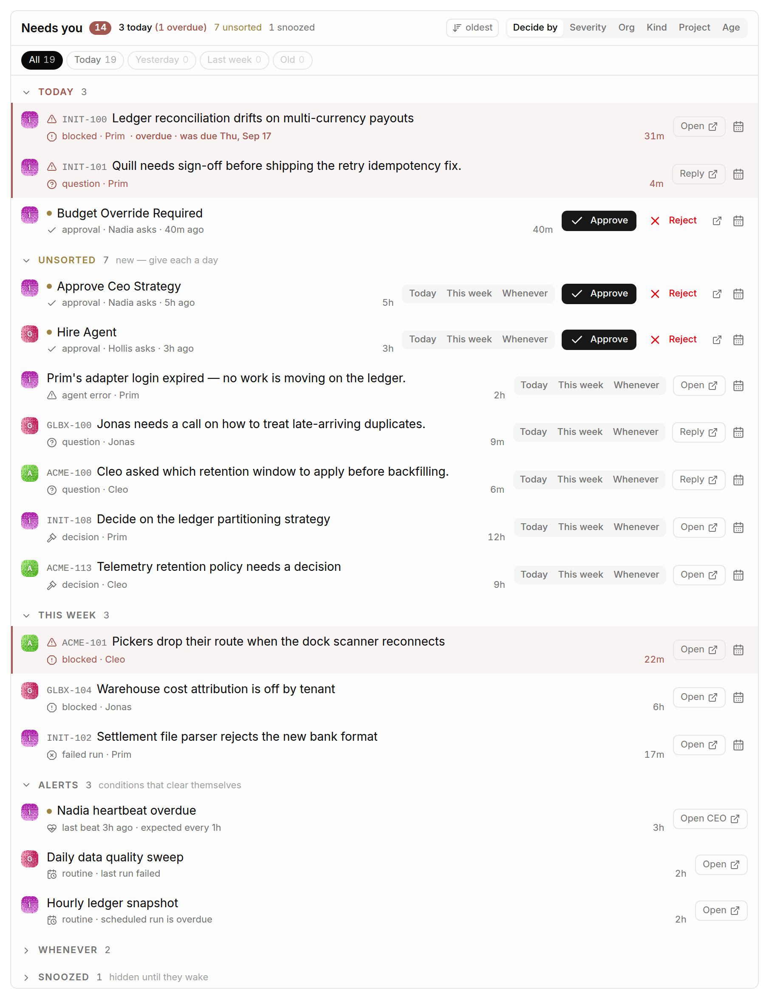
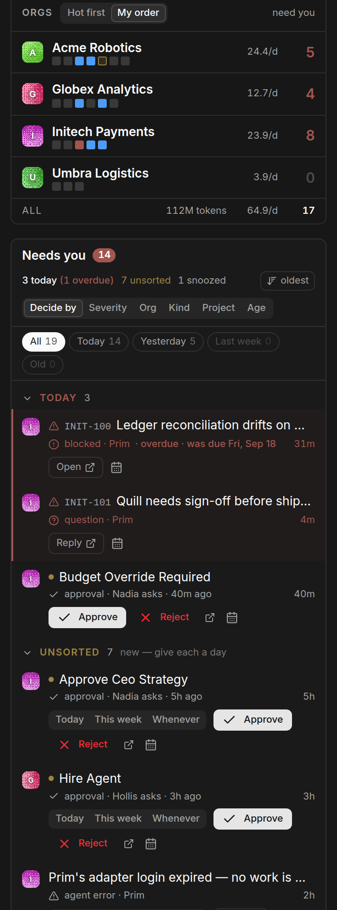

# Plica

A cross-org HUD for [Paperclip](https://github.com/paperclipai/paperclip). One page that
answers "what needs me, across every org, right now" — and lets you say *when* you will deal
with each thing — instead of visiting each org's dashboard in turn.

Plica is UI-only. It contributes one page (mounted at `/:companyPrefix/plica`) and a toolbar
launcher that navigates there. Its worker is a deliberate no-op.


> Every screenshot in this repository is Plica's own [demo mode](docs/configuration.md#demo-mode) —
> invented orgs, tickets and agents, not a real instance. Try it on your own install: add
> `?demo=1` to the Plica page's URL (e.g. `/ACME/plica?demo=1`). Nothing you click in demo mode
> reaches the server.

**Documentation:** [install](docs/install.md) · [configuration](docs/configuration.md) ·
[the board](docs/board.md) · [the queue](docs/queue.md) ·
[troubleshooting](docs/troubleshooting.md) · [release notes](docs/releases/)

## What it shows

**Queue** — the main column. Every item across every org that wants a human, in one list:
approvals, questions and confirmations awaiting a response, blockers, failed runs, overdue
heartbeats and routine exceptions. Actions are inline — Approve, Reject, Reply — so you rarely
need to open the org.

By default it groups by **when you said you'd decide**: Today (and anything overdue), Unsorted,
This week, Alerts, Whenever and Snoozed. New items land in Unsorted with **Today · This week ·
Whenever** right on the row, and every row has a menu to set a day, snooze or archive it. These
are Paperclip's own decision-triage records, so a day set in Plica is the day Paperclip's
Decisions page shows — and it works on stock Paperclip, through its existing web API.



It can also group by severity, org, kind, project or age — by project is how you find the one
project quietly generating half the noise.

**Orgs** — the left column: one line per org with who is working, runs per day and how much is
waiting on you. Hover a name for everything else (questions, blockers, review, open work, token
burn, a sparkline of recent runs, the lead agent). Orgs can be watched, sorted by heat, and
clicked to filter the queue.


Each org's capacity is a row of squares, one per agent — working, stalled, queued, errored or
idle. Hovering one says who it is and what they are actually doing, which is the thing a bare
"3 running" count cannot tell you.


**Portfolio and Routines** — projects by how much is moving, waiting or blocked, and the
routines that failed or stopped firing.

**Briefing** — what changed since your last visit.

**On a phone** — the page stacks Orgs, the queue, then Portfolio and Routines, and each queue
row puts its actions on a line of their own.



Full tours: [the board](docs/board.md), [the queue](docs/queue.md).

## Install

Plica is published to npm as `paperclip-plugin-plica`. In Paperclip, open the **Plugin
Manager** (Settings → Plugins, at `/company/settings/instance/plugins`), click **Install
Plugin**, and enter `paperclip-plugin-plica` as the **npm Package Name**. Or from the CLI:

```bash
npx paperclipai plugin install paperclip-plugin-plica
```

Either way needs an instance admin. The package is prebuilt and carries nothing tied to a
particular Paperclip build, so upgrading Paperclip later needs nothing from Plica.

### From source

For working on Plica, install it from a clone instead:

```bash
git clone https://github.com/nickallevato/paperclip-plica.git
cd paperclip-plica
pnpm install
pnpm build
npx paperclipai plugin install /absolute/path/to/paperclip-plica --local
```

[docs/install.md](docs/install.md) covers both routes: upgrading, the directory layout a clone
needs for its `link:` dependencies, and how to check the plugin actually loaded.

## Demo mode

Plica can serve the whole HUD from a bundled fixture instead of your instance, so the page can
be screenshotted or demoed without putting real company names, ticket titles or agent chatter
on screen. Turn it on with `?demo=1` or the **Demo mode** checkbox on the plugin's settings
page; the header carries a **DEMO DATA** badge the whole time it is on. It fails closed — a
fixture that will not load is an error, never a silent fall back to real data.

Details, including how to edit the fixture:
[docs/configuration.md](docs/configuration.md#demo-mode).

The screenshots in `docs/screenshots/` are demo mode with nothing else done to them, captured by
`scripts/capture-screenshots.mjs`. See [docs/screenshots/README.md](docs/screenshots/README.md).

## Why Plica subtracts the host's selectors

Plica compiles its own Tailwind sheet and injects it via `<style>` appended to `<head>` — after
the host's. Tailwind emits every class it scans, including ones Paperclip already defines, and a
duplicate that lands later wins on document order. A stray `.hidden{display:none}` is enough to
beat Paperclip's `@media(min-width:40rem){.sm\:flex{...}}` and pin the whole app — not just the
Plica page — in its mobile layout.

Ordering cannot fix this, in either direction. Appended last, Plica's duplicates beat the host's
responsive variants. Inserted first, Plica's `@layer` declarations come before the host's, which
pushes the host's `base`/`components` layers after `utilities` and breaks spacing app-wide.
Subtraction is the only approach that works.

So at injection, `src/ui/styles.ts` walks the document's other stylesheets through the CSSOM,
collects every selector they define, and deletes each of Plica's class rules the host already
has — trimming shared selector lists and dropping `@media`/`@layer`/`@supports` groups left
empty (`src/ui/lib/host-subtract.ts`). Against Paperclip's real sheet that drops about 480
selectors; Plica-only classes are untouched. Cross-origin sheets, which the browser will not let
a page read, are skipped — they are web-font CSS, not host utilities.

This used to be done once, at build time, against whichever Paperclip UI build was on the
builder's disk — which went stale on every Paperclip upgrade and meant rebuilding Plica after
each one. Subtracting against the sheets the page actually loaded leaves nothing to go stale: a
Paperclip upgrade needs no Plica rebuild, the build needs no Paperclip UI build, and one
published package fits whichever Paperclip stylesheet it lands next to.

## Vendored host components

`src/ui/host/` holds read-only copies of Paperclip internals Plica depends on — the ui-kit
primitives, `useCompanyOrder`, API client shapes. They are copies rather than imports because
Paperclip does not export them to plugins.

Keep them byte-identical to their upstream originals apart from import paths. Three documented
exceptions:

- `ui-kit/dialog.tsx` — plain Tailwind positioning, since the host's version leans on theme-only
  CSS variables the plugin sheet does not carry.
- `useCompanyOrder.ts` — read path only; the host's mutation and `persistOrder` are omitted
  because Plica never reorders.
- `ui-kit/hover-card.tsx` — a Plica original, not a copy. The host ships no HoverCard component,
  so there is nothing upstream to keep it identical to.

Anything else that drifts is a bug. `CompanyPatternIcon.tsx` in particular must match exactly:
Paperclip draws company avatars with its own copy, so any change here gives one company two
different identities on screen.

`pnpm check:vendored` compares every whole-file copy (and the route-root sets in `util.ts`)
against the Paperclip checkout, ignoring imports. Run it after each Paperclip upgrade;
`--diff` prints what moved.

## Development

```bash
pnpm dev             # esbuild watch + CSS rebuild
pnpm test            # vitest — needs a prior `pnpm build` on a fresh clone
pnpm typecheck       # tsc --noEmit
pnpm build           # CSS then bundle
pnpm check:surface   # the no-core-changes guardrail
pnpm hooks:install   # pre-commit: surface check, typecheck, test
```

Tests run in jsdom, which implements neither `HTMLCanvasElement.getContext` nor navigation. Both
log "Not implemented" errors during a passing run. That output is expected noise, not failure —
check the summary line.

## Layout

```
src/
  manifest.ts              plugin id, capabilities, entrypoints
  worker.ts                no-op
  ui/
    PlicaHud.tsx           root: owns the roster, sort mode, pins, token settings
    PlicaPage.tsx          host-mounted page slot
    PlicaToolbarButton.tsx toolbar launcher
    components/            company lines, queue, recent tasks, portfolio, briefing
    lib/                   capacity, queue grouping, run derivation, drafts
    host/                  vendored Paperclip internals (read-only)
    styles.ts              injects the compiled sheet, minus host duplicates, idempotently
scripts/
  build-css.mjs            Tailwind compile (host duplicates are subtracted at runtime)
  capture-screenshots.mjs  the images in docs/, from a running instance
  gen-demo-data.mjs        the demo fixture
  check-plugin-surface.mjs the no-core-changes guardrail
docs/                      the documentation set
```

## Reporting a bug, or asking for a feature

Open an issue from one of the three templates — feature request, bug report, or
core limitation. [docs/intake.md](docs/intake.md) is the whole path a request
takes from there to a merged change, including the two points where the
repository owner decides: the priority band, and the merge.

You will get an answer either way. A request that turns out to be a duplicate is
closed pointing at the original and its evidence is moved there first; one that
is real but not now is *parked*, not closed, and reopens on a sentence.

## Contributing

[CONTRIBUTING.md](CONTRIBUTING.md). The rule to read before anything else:
**Plica never modifies Paperclip core.** Everything lands here, through a plugin
extension point. If the plugin surface cannot express a change, file it as a
core limitation rather than working around it — CI enforces this, with no bypass.

## License

MIT
