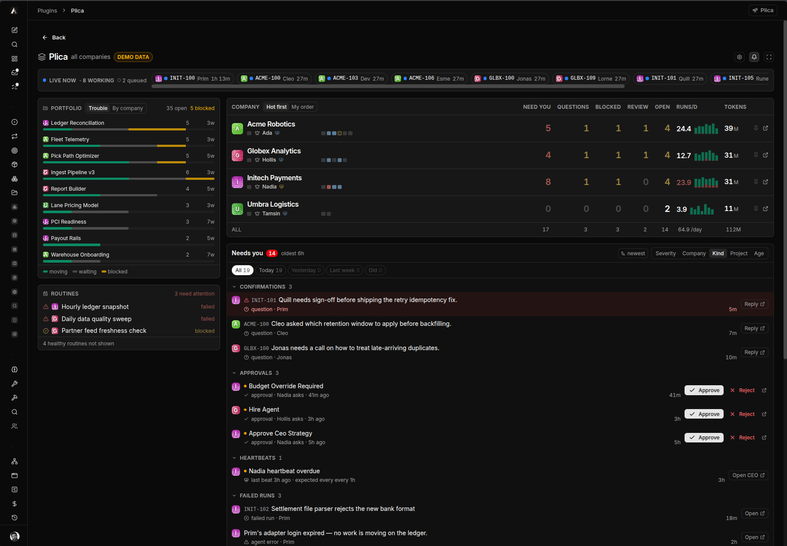
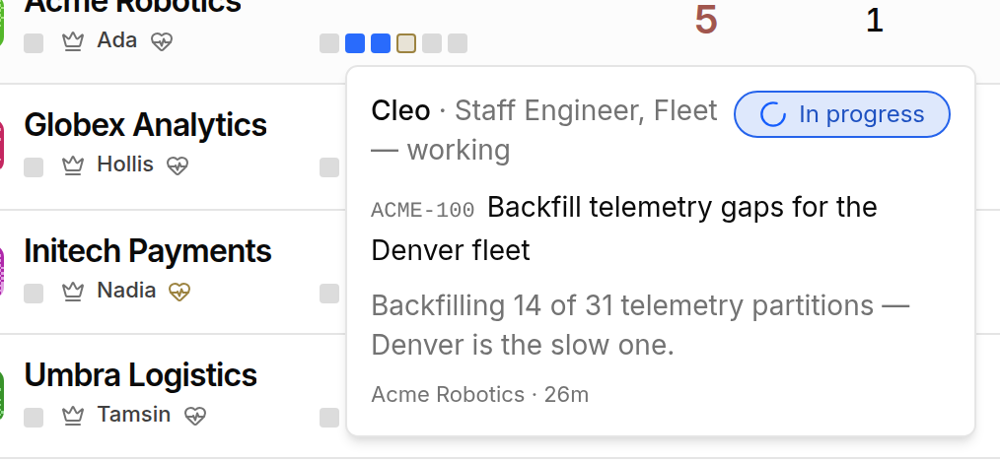
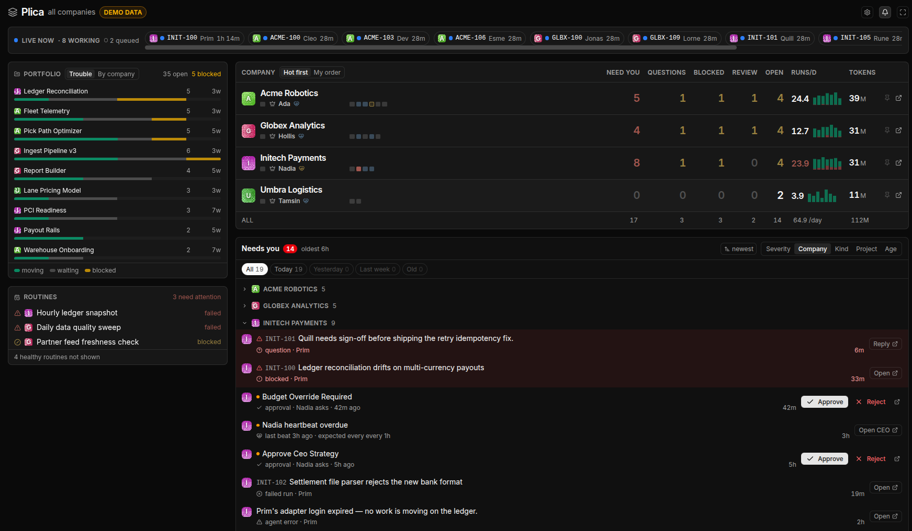
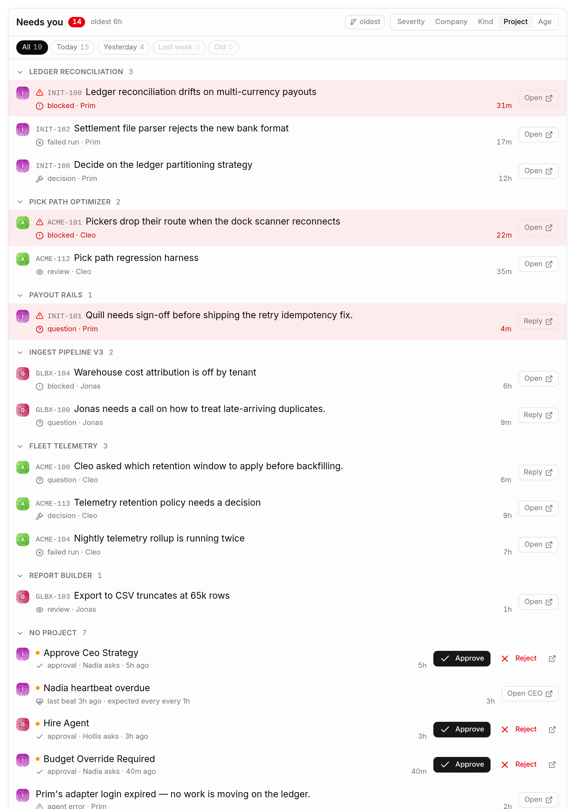

# Plica

A cross-company HUD for [Paperclip](https://github.com/paperclipai/paperclip). One page that
answers "what needs me, across every company, right now" — instead of visiting each company's
dashboard in turn.

Plica is UI-only. It contributes one page (mounted at `/:companyPrefix/plica`) and a sidebar
launcher that navigates there. Its worker is a deliberate no-op.



> Every screenshot on this page is Plica's own [demo mode](#demo-mode) — invented companies,
> tickets and agents, not a real instance.

## What it shows

**Board** (default) — one row per company: capacity, live runs, what is waiting on you, token
burn, and a sparkline of recent activity. Rows can be pinned, sorted by heat, and clicked to
filter the queue below.

Each company's capacity is a row of squares, one per agent — working, stalled, queued, errored
or idle. Hovering one says who it is and what they are actually doing, which is the thing a bare
"3 running" count cannot tell you.



**Queue** — every item across every company that wants a human, in one list: approvals,
interactions awaiting a response, failed runs, overdue heartbeats and routine exceptions.
Actions are inline — Approve, Reject, Reply — so you rarely need to open the company.

It groups by severity, company, kind, project or age. Grouping by company reads as a per-company
worklist; grouping by project cuts the same items the other way, which is how you find the one
project quietly generating half the noise.





**Briefing** — what changed since your last visit.

A classic layout is available behind a toggle; the board is the default.

## Install

Plica installs from a local path — it is not published to a registry.

```bash
git clone https://github.com/nickallevato/paperclip-plica.git
cd paperclip-plica
pnpm install
pnpm build
```

Then register it with your Paperclip instance:

```bash
npx paperclipai plugin install /absolute/path/to/paperclip-plica --local
```

Paperclip watches the installed package's `dist` output, so leaving `pnpm dev` running here
reloads the plugin in place.

The `@paperclipai/shared` and `@paperclipai/plugin-sdk` dev dependencies are `link:` references
to a Paperclip checkout at `~/paperclip`. Plica type-checks against **that** checkout, which is
how it stays honest about upstream API changes. If your checkout lives elsewhere, repoint the
two `link:` paths in `package.json`.

## Demo mode

Plica can serve the whole HUD from a bundled fixture instead of your instance, so the page can
be screenshotted or demoed without putting real company names, ticket titles or agent chatter
on screen. Four invented companies (Acme Robotics, Globex Analytics, Initech Payments, Umbra
Logistics), ~40 tickets, ~22 agents, live runs, approvals, an overdue routine and a company in
the red — enough that every surface has something to draw.

Two ways to turn it on:

- **`?demo=1`** on the Plica URL. Sticks for the rest of the browser session, so Plica's
  cross-company links (which do a full document load) stay in demo. `?demo=0` leaves. A
  remembered override is dropped as soon as the checkbox below is changed, so the setting can
  always take control back.
- **The "Demo mode" checkbox** on the host's plugin settings page, which Paperclip generates
  from the manifest's `instanceConfigSchema`. This is the durable setting. Paperclip stores
  plugin config per company while Plica is a cross-company page, so ticking the box for *any*
  one company turns the whole page into a demo — and reading it costs one `/api/companies` call
  at mount to learn which config row to ask for. Nothing real is rendered while that resolves.

When it is on, the header carries a **Demo data** badge, and every read *and write* in
`src/ui/host/api.ts` is answered from the fixture — approvals can be approved, interactions
answered, comments posted, and none of it leaves the page. If the fixture cannot be loaded,
Plica shows an error rather than falling back to real data: the mode fails closed on purpose.

### Editing the dummy data

The fixture is a real file, `dist/ui/demo-data.json`, served out of the plugin's own asset
directory — so renaming a company or rewording a ticket is an edit plus a reload, no rebuild.

Plica addresses it as `/_plugins/<plugin row UUID>/ui/demo-data.json`, looking the UUID up from
`/api/plugins` at activation. The plugin-key form of that route is documented to work but does
not: `plugin-ui-static.ts` catches the `getById` failure by reading `error.code`, while drizzle
wraps the Postgres error so the `22P02` sits on `error.cause` — the guard misses, and any
non-UUID plugin id 500s before reaching the `getByKey` fallback. Nothing upstream trips over it
because the host builds its own bundle URLs from the UUID it already holds.

For anything structural, edit the tables at the top of `scripts/gen-demo-data.mjs` and
regenerate; a test asserts the committed JSON matches the generator's output, so hand-edits to
`src/ui/demo/demo-data.json` will fail CI.

```bash
pnpm demo:data   # regenerate src/ui/demo/demo-data.json
pnpm build       # copies it to dist/ui/demo-data.json
```

Timestamps in the fixture are relative tokens (`"@t:-5m"`, `"@d:-3"`) resolved against page-load
time, so the demo never reads as months stale no matter when it is shown.

The screenshots at the top of this README are demo mode with nothing else done to them, which is
exactly the intended use: turn it on, take the picture, publish it.

## The stylesheet coupling

**Rebuilding Paperclip's UI requires rebuilding Plica.** This is the one operational rule worth
knowing. Plica now notices when it has been broken and says so — see "The staleness warning"
below — but noticing is all it does; the rebuild is still yours to run.

Plica compiles its own Tailwind sheet and injects it via `<style>` appended to `<head>` — after
the host's. Tailwind emits every class it scans, including ones Paperclip already defines, and a
duplicate that lands later wins on document order. A stray `.hidden{display:none}` is enough to
beat Paperclip's `@media(min-width:40rem){.sm\:flex{...}}` and pin the whole app in its mobile
layout.

`scripts/build-css.mjs` fixes this by subtracting every selector the host stylesheet already
ships (it refuses to emit an unfiltered sheet at all). But the subtraction is computed **once, at
build time**, against whichever `~/paperclip/ui/dist/assets/index-*.css` exists then. Upgrade
Paperclip and that file is rebuilt under a new hash — the subtraction is now stale, and classes
the new host defines are no longer filtered out.

So: after any Paperclip upgrade, run `pnpm build` here. Override the host sheet location with
`PLICA_HOST_CSS` if needed.

Ordering cannot fix this, in either direction. Appended last, Plica's duplicates beat the host's
responsive variants. Inserted first, Plica's `@layer` declarations come before the host's, which
pushes the host's `base`/`components` layers after `utilities` and breaks spacing app-wide.
Subtraction is the only approach that works.

### The staleness warning

The reason that rule needed writing down is that breaking it looks like nothing to do with Plica:
the symptom is Paperclip's own sidebar and chrome stranded in the mobile layout, and the person
who upgraded has no reason to suspect a plugin they installed weeks ago.

So Plica records what it subtracted against and checks it at runtime. `scripts/build-css.mjs`
writes the host sheet's filename and a content hash to `src/ui/host-css.generated.json`, esbuild
inlines that into the UI bundle, and at mount Plica compares it against the stylesheet the
document actually loaded — read from the `<link>` tags, using nothing but the DOM. On a mismatch
the Plica header carries a **Stylesheet stale** badge beside `Demo data`, whose hover text names
the fix (`pnpm build`) and shows both identifiers, recorded and observed. The same text is repeated
in an `sr-only` span, because assistive technology cannot hover.


**It fails open.** If the host's stylesheet cannot be identified — no same-origin stylesheet link,
several that are equally plausible, or a bundle built with no record at all — Plica shows nothing
rather than a warning it cannot stand behind. A false "your plugin is stale" on every load teaches
people to ignore the badge that matters.

The filename is what gets compared, not the content hash. Paperclip's sheet is Vite-built and
hash-named, so the name already changes whenever the bytes do, and reading a name off a `<link>`
costs nothing — where an observed content hash would mean fetching and hashing ~450KB of CSS on
every page load. The recorded hash is kept for the badge to display and for comparing two installs
by hand. The gap that leaves: a host serving an *unhashed* stylesheet name could be rebuilt under
the same name with the check staying quiet. That is the fail-open direction, and deliberate.

To see the badge: point `PLICA_HOST_CSS` at a different sheet, `pnpm build`, and load the page.

## Vendored host components

`src/ui/host/` holds read-only copies of Paperclip internals Plica depends on — the ui-kit
primitives, `useCompanyOrder`, API client shapes. They are copies rather than imports because
Paperclip does not export them to plugins.

Keep them byte-identical to their upstream originals apart from import paths. Two deliberate
exceptions, both documented in the files themselves:

- `ui-kit/dialog.tsx` — plain Tailwind positioning, since the host's version leans on theme-only
  CSS variables the plugin sheet does not carry.
- `useCompanyOrder.ts` — read path only; the host's mutation and `persistOrder` are omitted
  because Plica never reorders.

Anything else that drifts is a bug. `CompanyPatternIcon.tsx` in particular must match exactly:
Paperclip draws company avatars with its own copy, so any change here gives one company two
different identities on screen.

## Development

```bash
pnpm dev         # esbuild watch + CSS rebuild
pnpm test        # vitest
pnpm typecheck   # tsc --noEmit
pnpm build       # CSS then bundle
pnpm hooks:install   # pre-commit: typecheck + test
```

Tests run in jsdom, which implements neither `HTMLCanvasElement.getContext` nor navigation. Both
log "Not implemented" errors during a passing run. That output is expected noise, not failure —
check the summary line.

## Layout

```
src/
  manifest.ts              plugin id, capabilities, entrypoints
  worker.ts                no-op
  ui/
    PlicaHud.tsx           root: owns the roster, sort mode, pins, token settings
    PlicaPage.tsx          host-mounted page slot
    PlicaToolbarButton.tsx sidebar launcher
    components/            board rows, queue, portfolio, briefing, strips
    lib/                   capacity, queue grouping, run derivation, drafts
    host/                  vendored Paperclip internals (read-only)
    styles.ts              injects the compiled sheet, idempotently
scripts/build-css.mjs      Tailwind compile + host-duplicate subtraction
```

## Reporting a bug, or asking for a feature

Open an issue from one of the three templates — feature request, bug report, or
core limitation. [docs/intake.md](docs/intake.md) is the whole path a request
takes from there to a merged change, including the two points where the
repository owner decides: the priority band, and the merge.

You will get an answer either way. A request that turns out to be a duplicate is
closed pointing at the original and its evidence is moved there first; one that
is real but not now is *parked*, not closed, and reopens on a sentence.

## Contributing

[CONTRIBUTING.md](CONTRIBUTING.md). The rule to read before anything else:
**Plica never modifies Paperclip core.** Everything lands here, through a plugin
extension point. If the plugin surface cannot express a change, file it as a
core limitation rather than working around it — CI enforces this, with no bypass.

## License

MIT
