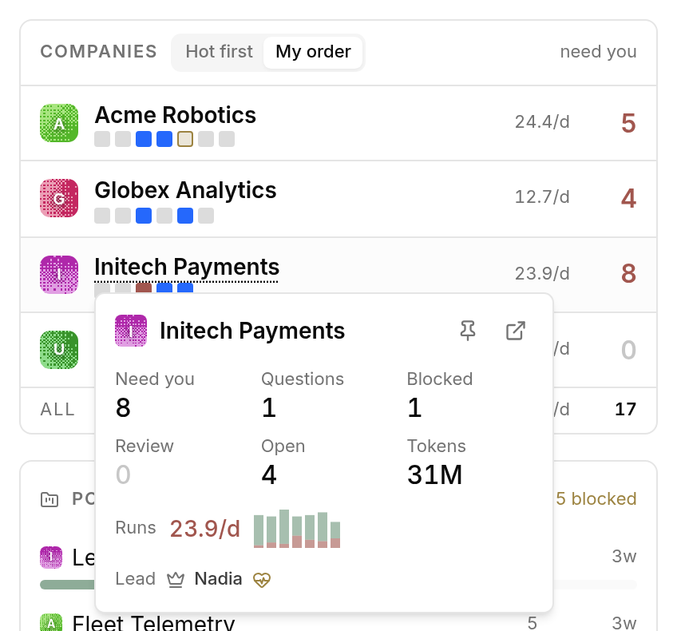

# The Board

The Plica page is two columns. On the left, context: **Companies** (one line per
company), the **Portfolio**, and **Routines** that need attention. On the right,
owning the main column, the **[queue](queue.md)** — because that is where the
work is. A strip of everything running right now spans the top.

When there is not room for both columns, the page stacks: Companies, then the
queue, then Portfolio and Routines.

## Companies

Each company is one line: its name, its capacity strip (see below), runs per
day, and **Need you** — pending approvals + undismissed attention items + an
overdue CEO heartbeat, the same number the queue is showing for that company.

Need you is the only coloured figure: **ochre** when something waits, **brick**
when any of it is critical or high. A zero is dimmer than muted text, so a
clear company reads as an empty field.

The last line is the cross-company total: tokens this month, runs per day, and
everything that needs you.

### The detail card

Hovering a company's name opens everything the line leaves out:

| Figure | What it counts |
| --- | --- |
| **Need you** | As above. |
| **Questions** | Open `ask_user_questions` interactions waiting on you. |
| **Blocked** | Blockers waiting on you (the tooltip has the total blocked). |
| **Review** | Items waiting on your review. |
| **Open** | Open issues (the tooltip splits in-progress and blocked). |
| **Tokens** | This calendar month's tokens, in millions. Coloured by your [thresholds](configuration.md#token-thresholds). |
| **Runs** | Runs per day over the last week, with a sparkline; brick at a 20% failure rate. |
| **Lead** | The CEO agent and their heartbeat. |

The card also carries **Watch** (the pin) and **Open** (the company's dashboard).

## Capacity

Under each company name is a row of small squares, **one per agent**:

| Square | Means |
| --- | --- |
| working | The agent has a run in flight. |
| stalled | Running, but nothing has come out of it for 20 minutes. |
| queued | Waiting for a slot. |
| errored | The agent is in an error state. |
| idle | Nothing assigned. |

Hovering one says who it is and what they are actually doing — the thing a bare
"3 running" count cannot tell you.

A stall is the case worth knowing about: the run has not failed, so nothing
alerts, and the count still says three agents are working. The square goes
amber at twenty minutes of silence.

## Live

Across the top of the page, one pill per run in flight: company, ticket, agent,
elapsed.

The strip is exactly one row tall and cannot grow. Titles and agent narration
live in the hover card, so a long ticket title can never wrap a pill onto a
second line and shove the whole board down the page. There is no cap and no
"+N more" — the row scrolls sideways, so the header count and what you can
actually reach always agree.

## Ordering companies

Two controls sit in the Companies header:

- **My order** — the same order as your sidebar company switcher, drag order
  included.
- **Hot first** — sorted by heat.

**Heat** is computed and never drawn. Need-you and the other columns already say
whether a company wants you, so a heat mark beside them would just restate it.
Its job is the row order — the one thing those columns cannot do, because heat
folds in things none of them show: an unreachable company, a stalled run, an
errored agent, an open decision, tokens past your threshold. The sort is stable,
so equal-heat companies keep your own order and the list only reshuffles when a
company's situation actually changes.

**Watch** (the pin in a company's detail card) keeps a company at the top
regardless of sort, marked with a small pin beside its name. Watches persist
per browser.

## Clicking a company

Clicking anywhere on a company's line that is not a control **filters the queue
to that company**. Click again to show all companies. The company name picks up a
dotted underline while the filter is on, and the queue grows a "Show all
companies" control.

This is a focus, not a preference: it is deliberately not persisted, so a new
visit always starts on the whole portfolio.

## When a company cannot be reached

If a company's poll fails outright, its line is marked unreachable and its
figures are blanked rather than drawn as zeroes — a company you cannot see is
not a company with nothing happening.

If polls are merely erroring intermittently, a **polling degraded** warning
appears in the page header. See
[Troubleshooting](troubleshooting.md#polling-degraded-in-the-header).

## The rail

Down the left of the board:

**Portfolio** — every project with open work, across every company, as one
chart. Each bar splits into moving / waiting / blocked, and the header carries
the totals. Sort by **Trouble** (worst first) or **Company**. What people
actually read off the old list was the shape of the work, so it became a chart.

**Routines** — schedules that are *not* firing: failed, blocked, or overdue.
Healthy routines are a count in the footer and nothing else ("4 healthy routines
not shown"). A list that gave the two broken ones the same weight as the
eighteen that were fine was a list nobody read.

**Briefing** — what changed since your last visit, as the rail's footer. It
appears only when your previous visit was more than 30 minutes ago, and it can
be dismissed for the current visit.

