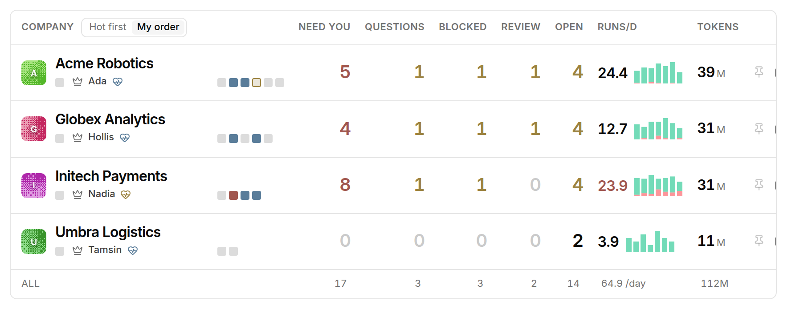
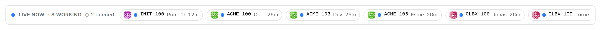
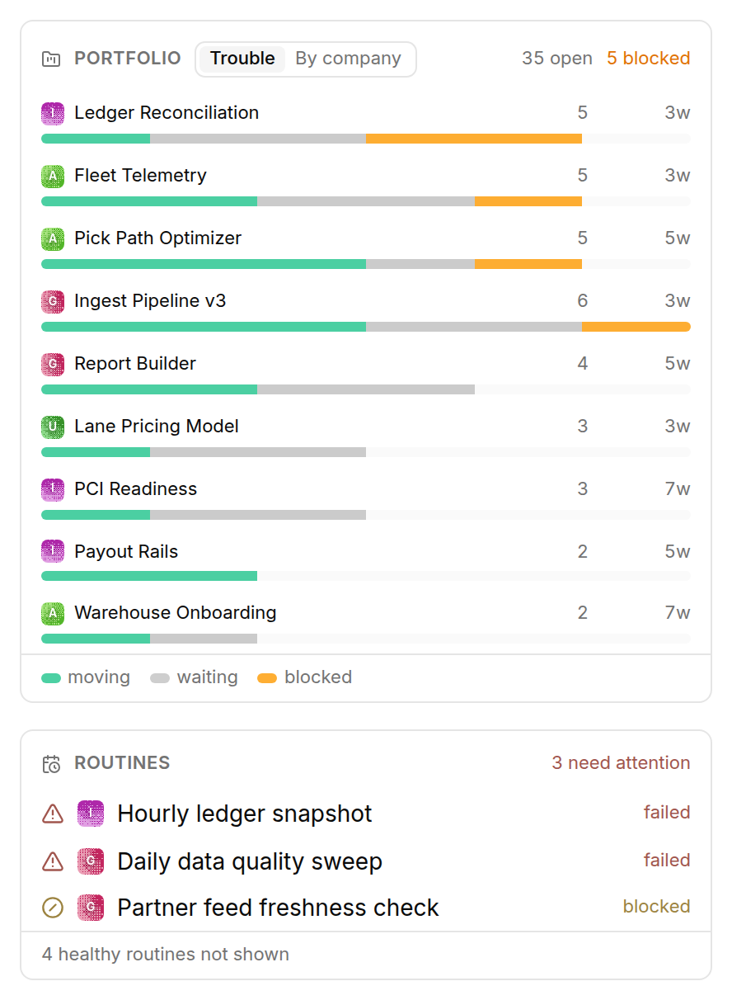
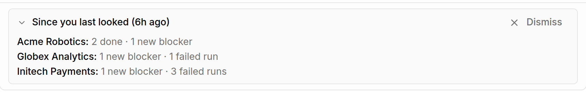

# The Board

The board is the top half of the Plica page: one row per company, and above it a
strip of everything running right now.

## The columns

Order is the argument. What is waiting on you sits immediately right of the
company name, because those are the only two figures you can act on. Everything
after them is context.

| Column | What it counts |
| --- | --- |
| **Company** | Name, the CEO agent, and the capacity strip — see below. |
| **Need you** | Pending approvals + undismissed attention items + an overdue CEO heartbeat. The same number the queue below is showing for that company. |
| **Questions** | Open `ask_user_questions` interactions. |
| **Blocked** | Issues that are blocked. |
| **Review** | Issues waiting on review. |
| **Open** | Open issues. |
| **Runs/d** | Runs per day, recent average. |
| **Tokens** | This calendar month's tokens, in millions. Coloured by your [thresholds](configuration.md#token-thresholds). |

The last row is the cross-company total, so the number at the top of a column
and the number at the bottom always agree.

Colour marks only the exception: **ochre** for waiting on you, **brick** for
broken, and nothing at all for a company that is fine. A zero is dimmer than
muted text, so a clear company reads as an empty field rather than a row of
noughts you have to check.

Every cell's detail — the oldest wait, the in-progress/blocked split — is in its
tooltip rather than under the number, which is what keeps all rows one height.

## Capacity

Beside each company name is a row of small squares, **one per agent**:

| Square | Means |
| --- | --- |
| working | The agent has a run in flight. |
| stalled | Running, but nothing has come out of it for 20 minutes. |
| queued | Waiting for a slot. |
| errored | The agent is in an error state. |
| idle | Nothing assigned. |

Hovering one says who it is and what they are actually doing — the thing a bare
"3 running" count cannot tell you.

A stall is the case worth knowing about: the run has not failed, so nothing
alerts, and the count still says three agents are working. The square goes
amber at twenty minutes of silence.

## Live

Across the top of the board, one pill per run in flight: company, ticket, agent,
elapsed.

The strip is exactly one row tall and cannot grow. Titles and agent narration
live in the hover card, so a long ticket title can never wrap a pill onto a
second line and shove the whole board down the page. There is no cap and no
"+N more" — the row scrolls sideways, so the header count and what you can
actually reach always agree.

## Ordering rows

Two controls sit above the Company column:

- **My order** — the same order as your sidebar company switcher, drag order
  included.
- **Hot first** — sorted by heat.

**Heat** is computed and never drawn. Need-you and the other columns already say
whether a company wants you, so a heat mark beside them would just restate it.
Its job is the row order — the one thing those columns cannot do, because heat
folds in things none of them show: an unreachable company, a stalled run, an
errored agent, an open decision, tokens past your threshold. The sort is stable,
so equal-heat companies keep your own order and the board only reshuffles when a
company's situation actually changes.

**Pin** (the pin at the right of a row) keeps a company at the top of the board
regardless of sort. Pins persist per browser.

## Clicking a row

Clicking anywhere on a row that is not a control **filters the queue below to
that company**. Click again to show all companies. The company name picks up a
dotted underline while the filter is on, and the queue grows a "Show all
companies" control.

This is a focus, not a preference: it is deliberately not persisted, so a new
visit always starts on the whole portfolio.

## When a company cannot be reached

If a company's poll fails outright, its row is marked unavailable and its
figures are blanked rather than drawn as zeroes — a company you cannot see is
not a company with nothing happening.

If polls are merely erroring intermittently, a **polling degraded** warning
appears in the page header. See
[Troubleshooting](troubleshooting.md#polling-degraded-in-the-header).

## The rail

Down the left of the board:

**Portfolio** — every project with open work, across every company, as one
chart. Each bar splits into moving / waiting / blocked, and the header carries
the totals. Sort by **Trouble** (worst first) or **By company**. What people
actually read off the old list was the shape of the work, so it became a chart.

**Routines** — schedules that are *not* firing: failed, blocked, or overdue.
Healthy routines are a count in the footer and nothing else ("4 healthy routines
not shown"). A list that gave the two broken ones the same weight as the
eighteen that were fine was a list nobody read.

**Briefing** — what changed since your last visit, as the rail's footer. It
appears only when your previous visit was more than 30 minutes ago, and it can
be dismissed for the current visit.

