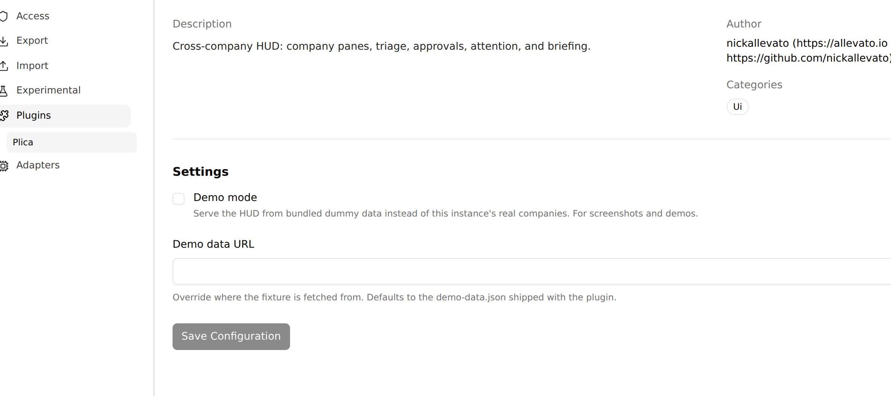
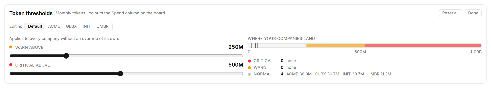

# Configuration

Plica has two kinds of setting: a small amount of **instance config** the host
stores for it, and a larger amount of **per-browser preference** it stores
itself. Nothing here is per-user on the server.

## Instance settings

Paperclip generates a settings form for every plugin from its manifest. Plica's
lives at:

```
/<COMPANY-PREFIX>/company/settings/instance/plugins/<plugin id>
```



**Demo mode** — serve the whole HUD from a bundled fixture instead of this
instance. See below.

**Demo data URL** — *currently ignored.* The field is declared in the manifest
and the host renders it, but nothing reads the value; the fixture is always
loaded from the copy shipped with the plugin. Do not rely on it until this note
goes away.

> Paperclip stores plugin config **per company**, while Plica is a cross-company
> page. So ticking Demo mode for *any one* company turns the whole page into a
> demo. Reading the setting costs one `/api/companies` call at mount, to work
> out which config row to ask for; nothing real is rendered while that resolves.

## Demo mode

Demo mode serves every read *and write* from a bundled fixture: four invented
companies (Acme Robotics, Globex Analytics, Initech Payments, Umbra Logistics),
~40 tickets, ~22 agents, live runs, approvals, an overdue routine and a company
in the red. Enough that every surface has something to draw.

It exists so the page can be screenshotted or demonstrated without putting real
company names, ticket titles or agent chatter on screen. Every image in these
docs is demo mode with nothing else done to it.

### Turning it on

Two switches:

- **`?demo=1`** on the Plica URL. Sticks for the rest of the browser session, so
  Plica's cross-company links (which do a full document load) stay in demo.
  `?demo=0` leaves. This is the switch to reach for mid-demonstration.
- **The Demo mode checkbox** on the settings page above. This is the durable
  one. Changing the checkbox drops any remembered `?demo=` override, so the
  setting can always take control back.

While it is on, the header carries an orange **DEMO DATA** badge. That is
deliberately hard to miss: a screenshot of this page is meant to be shareable,
which only works if nobody can mistake the fixture for a real instance.

### What it substitutes

Every read and write in the HUD funnels through one function, and demo mode
replaces that function. So approvals can be approved, interactions answered and
comments posted during a walkthrough, and none of it reaches the server. No
component knows demo mode exists, which is why none of them can leak real data
by forgetting about it.

It **fails closed**: if the fixture cannot be loaded, Plica shows an error
rather than falling back to real data.

### Editing the fixture

The fixture is a real file at `dist/ui/demo-data.json`, served out of the
plugin's own asset directory — so renaming a company or rewording a ticket is an
edit plus a reload, no rebuild.

For anything structural, edit the tables at the top of
`scripts/gen-demo-data.mjs` and regenerate. A test asserts the committed JSON
matches the generator's output, so hand-edits to `src/ui/demo/demo-data.json`
fail CI.

```bash
pnpm demo:data   # regenerate src/ui/demo/demo-data.json
pnpm build       # copies it to dist/ui/demo-data.json
```

Timestamps in the fixture are relative tokens (`"@t:-5m"`, `"@d:-3"`) resolved
against page-load time, so the demo never reads as months stale no matter when
it is shown.

## Token thresholds

The **gear** in the page header opens the token panel.



Two numbers — **warn** and **critical** — applied to a company's tokens for the
current calendar month. They colour the Tokens column on the board and feed the
heat sort.

Two scopes: a **default** that applies to every company, and an optional
**override** per company. Inheriting is the absence of an override rather than a
copy of the default, so raising the default afterwards still moves everyone who
never opted out.

They are sliders rather than number fields because the useful question is not
"what number" but "where does this line fall relative to my companies" — which
the rail below the sliders answers by plotting each company's actual usage
against the bands. Dragging one line past the other pushes it rather than
clamping, so a drag never silently stops moving.

Defaults are 250M (warn) and 500M (critical).

## Alerts

The **bell** in the header toggles browser notifications. Off by default.

Turning it on asks for notification permission only while the browser has not
yet been asked. Plica raises an alert on an *edge* — a company going red, a
critical attention item arriving, a CEO heartbeat going overdue — not on every
poll that finds the condition still true.

## Kiosk mode

The **expand** control in the header fullscreens the HUD and bumps its type
scale by roughly 1.3× — for a wall display or a TV across the room. Exit with
the same button, `Esc`, or your browser's own control.

It is deliberately not persisted: it always starts off, and fullscreen state is
read from the browser rather than remembered, since fullscreen can be left by
means Plica never sees.

## What Plica remembers

All of this lives in `localStorage`, per browser. Nothing is stored on the
server, so it does not follow you between machines.

| Key | What |
| --- | --- |
| `plica.pinned` | Companies pinned to the top of the board. |
| `plica.sort` | Board order: your order, or hot first. |
| `plica.queueGrouping` | Queue grouping. |
| `plica.queueSort` | Queue age tiebreaker. |
| `plica.queueAgeFilter` | Queue age chip. |
| `plica.portfolioSort` | Portfolio order. |
| `plica.alerts` | Alerts on/off. |
| `plica.tokenThresholds` | Token defaults and per-company overrides. |
| `plica.lastVisit` | Drives the briefing strip. Refreshed on mount and every 5 minutes. |

Two things are deliberately **not** remembered: the board's company focus (a
glance, not a habit — a new visit should start on the whole portfolio) and
kiosk mode.

Clearing site data resets all of it to defaults. Nothing breaks; the page just
starts over.

## How often it polls

Per dataset, not one interval for everything, and **nothing polls in a hidden
tab**:

| Every | What |
| --- | --- |
| 5s | Company summary, live runs, attention feed. |
| 15s | Approvals. |
| 30s | Agents. |
| 60s | Issues, projects, routines. |
| 5m | Token spend. |

Countdowns and elapsed times are computed at render, so they stay live between
fetches.
