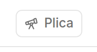
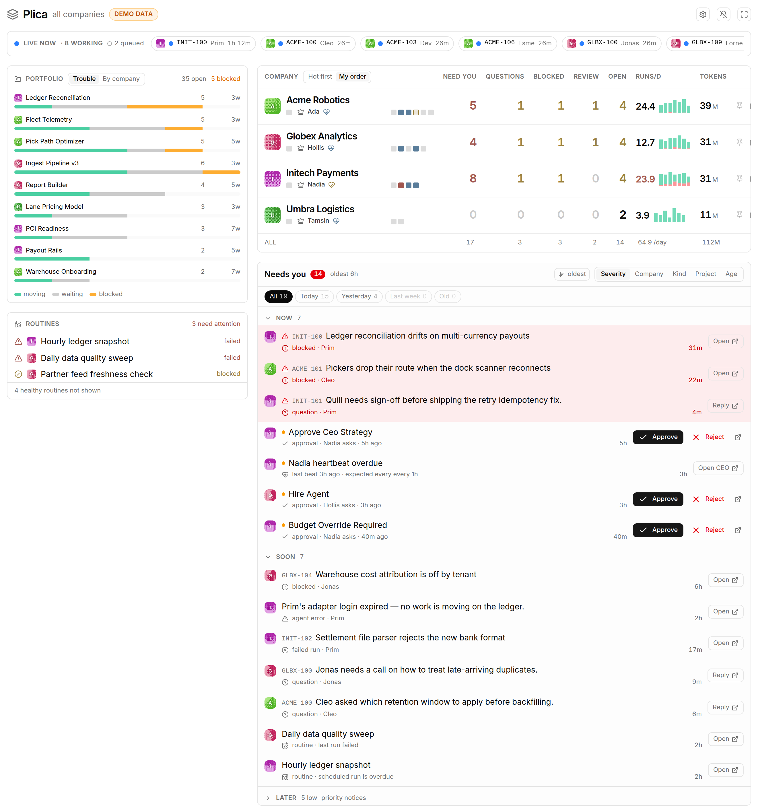

# Install

Plica is not published to a registry. You clone it, build it, and register the
built folder with a Paperclip instance that can read that path off disk.

## Before you start

- **Node.js 24.11 or newer**, and **pnpm**.
- **A Paperclip checkout you can run from source.** Two separate reasons: local
  plugin installs read the plugin's source from disk, so the server has to be
  able to see the path you give it; and Plica type-checks and builds against
  that checkout (see [Where the checkout has to live](#where-the-checkout-has-to-live)).
- **The instance running.** `pnpm paperclipai run` in the Paperclip checkout, or
  however you normally start yours.

## 1. Build it

```bash
git clone https://github.com/nickallevato/paperclip-plica.git
cd paperclip-plica
pnpm install
pnpm build
```

`pnpm build` does two things: compiles Plica's stylesheet (subtracting every
selector the host already ships — see [the stylesheet coupling](#after-a-paperclip-upgrade-rebuild-plica))
and bundles `dist/manifest.js`, `dist/worker.js` and `dist/ui/`. That `dist`
folder is what Paperclip loads.

> **`pnpm test` needs a build first.** The test suite imports the generated
> stylesheet, which `pnpm build` produces and git ignores. On a fresh clone,
> run `pnpm build` before `pnpm test`.

### Where the checkout has to live

`package.json` declares `@paperclipai/shared` and `@paperclipai/plugin-sdk` as
`link:` dependencies pointing at `../../paperclip/packages/...`, relative to
this repository. Plica type-checks against the real upstream types that way,
which is how it finds out about a breaking Paperclip change at build time
rather than in the browser.

The consequence is a required directory layout: **the Paperclip checkout must
be two levels above this repo.**

```
~/dev/
├── paperclip/           ← the Paperclip checkout
└── plugins/
    └── paperclip-plica/ ← this repo
```

Clone it somewhere else and `pnpm install` fails to resolve those two
dependencies. Repoint the paths in `package.json` locally if you need to — but
do not commit the repoint; it would break everyone else's layout.

`pnpm build` additionally reads Paperclip's *compiled* stylesheet, which it
looks for at `~/paperclip/ui/dist/assets/index-*.css`. If your checkout is not
at `~/paperclip`, point `PLICA_HOST_CSS` at that file:

```bash
PLICA_HOST_CSS=~/dev/paperclip/ui/dist/assets/index-abc123.css pnpm build
```

The build refuses to emit an unfiltered stylesheet, so a wrong or missing path
is a loud failure rather than a subtly broken app.

## 2. Register it with your instance

```bash
paperclipai plugin install /absolute/path/to/paperclip-plica --local
```

Before it installs, the CLI prints which instance it is about to install into:

```
Target Paperclip: http://127.0.0.1:3100
  health: status=ok  version=0.1.0  mode=local_trusted  exposure=private
Installing plugin from local path: /home/you/dev/plugins/paperclip-plica
✓ Installed nickallevato.plugin-plica v0.3.0 (ready)
```

**Read that first line.** If the URL is not the instance you meant, stop and
re-point the CLI rather than trusting the result. The CLI targets whatever
`PAPERCLIP_API_URL` says, which is easy to inherit from a shell you forgot
about.

## 3. Confirm it loaded

```bash
paperclipai plugin list
paperclipai plugin inspect nickallevato.plugin-plica
```

You want `status=ready`. `inspect` prints the full last error if it is anything
else.

## 4. Find it in the UI

Plica adds two things:

**A Telescope button** in the breadcrumb bar, above every page in every company.



**A page** at `/<COMPANY-PREFIX>/plica` — for example `/ACME/plica`. The prefix
is the company's issue prefix. Plica shows every company regardless of which
one's prefix is in the URL; the prefix is only there because the host mounts
plugin pages under a company route.



If the page is blank or the app looks broken, go to
[Troubleshooting](troubleshooting.md).

## Developing against it

```bash
pnpm dev   # esbuild watch + CSS rebuild
```

Paperclip watches the installed folder's `dist` output and reloads the plugin in
place, so leaving `pnpm dev` running gives you edit-and-refresh.

## After a Paperclip upgrade, rebuild Plica

**This is the one operational rule worth knowing, and nothing enforces it.**

Plica compiles its own Tailwind sheet and injects it after the host's. Tailwind
emits every class it scans, including ones Paperclip already defines, and a
duplicate that lands later wins on document order — a stray
`.hidden{display:none}` is enough to beat Paperclip's
`@media(min-width:40rem){.sm\:flex{…}}` and pin the whole app in its mobile
layout.

The build prevents this by subtracting every selector the host stylesheet
already ships. But the subtraction is computed **once, at build time**, against
whichever `index-*.css` existed then. Upgrade Paperclip, and that file is
rebuilt under a new hash: the subtraction is now stale, and classes the new host
defines are no longer filtered out.

So, after upgrading Paperclip:

```bash
cd paperclip-plica
pnpm build
```

The symptom of forgetting is described under
[the app looks broken](troubleshooting.md#the-whole-app-is-stuck-in-its-mobile-layout).

## Upgrading Plica

```bash
git pull
pnpm install
pnpm build
```

The installed path has not changed, so Paperclip picks up the new `dist` on its
own. If it does not, `paperclipai plugin disable nickallevato.plugin-plica`
followed by `enable` reloads it.

## Uninstalling

```bash
paperclipai plugin uninstall nickallevato.plugin-plica
```

Add `--force` to purge its stored config as well. Plica's per-browser
preferences live in `localStorage` and are not touched by either; see
[Configuration](configuration.md#what-plica-remembers).
