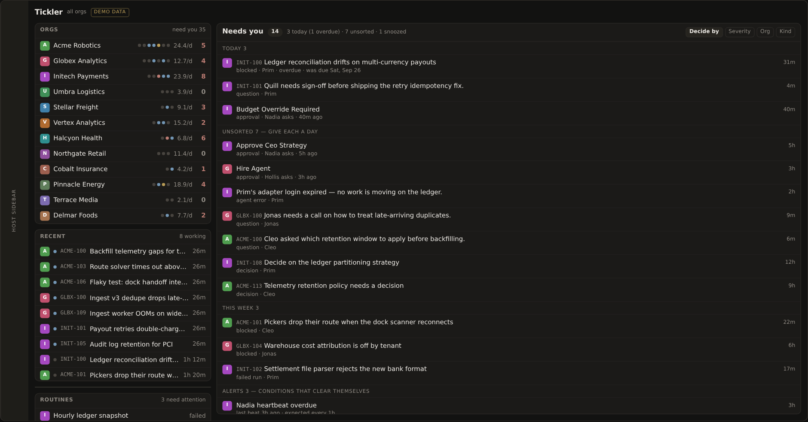
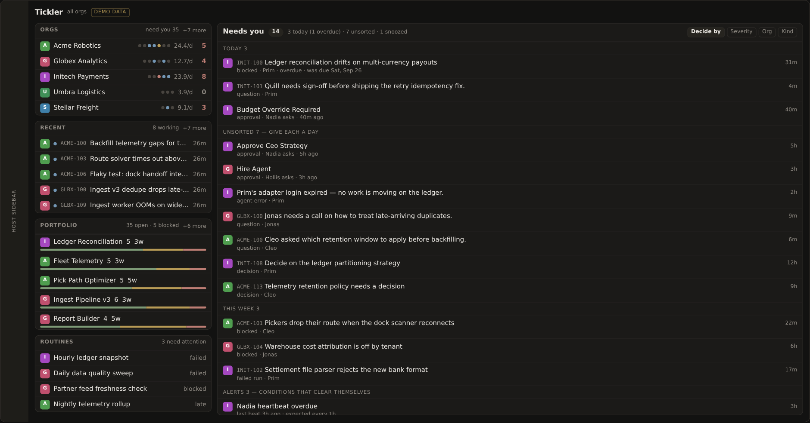
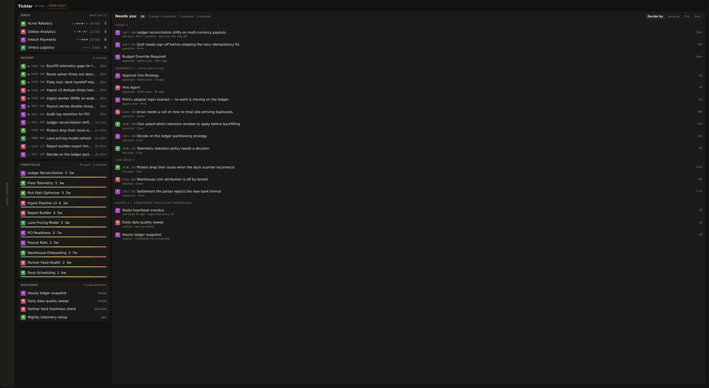
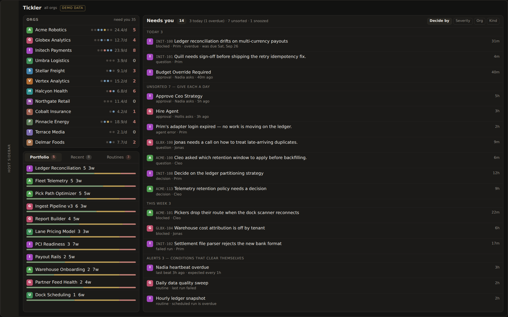
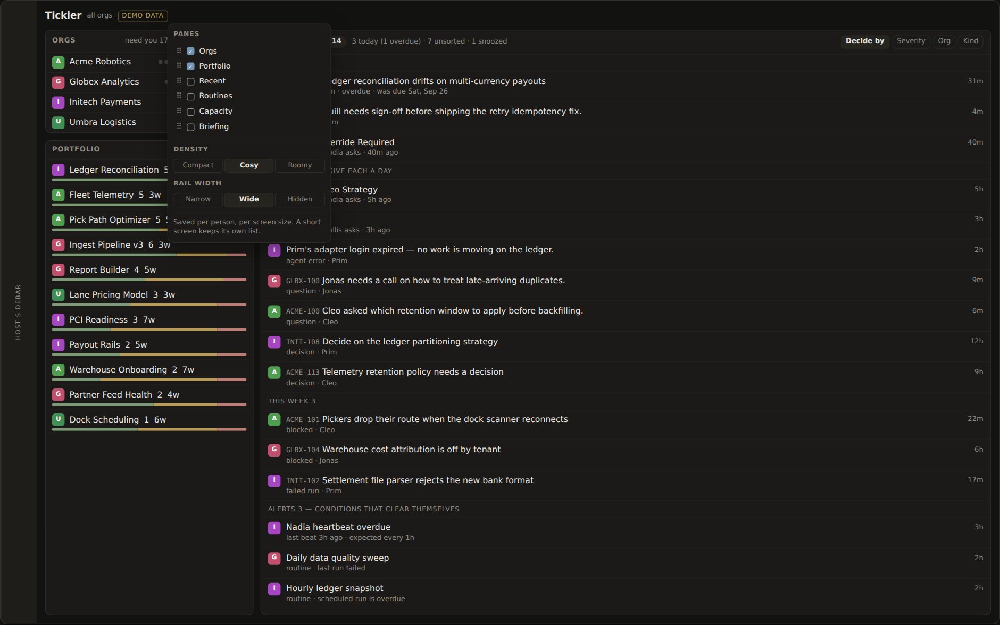
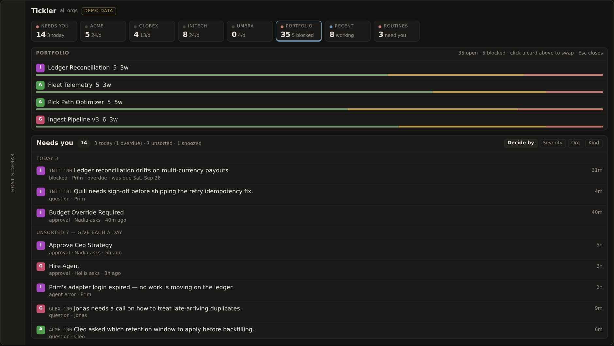

# Mockups

Standalone design studies. Each is a single HTML file with no build step and no
server — open it in a browser, or `xdg-open` it. They carry placeholder data,
never a real company.

| File | What it studies |
| --- | --- |
| [`board-v2.html`](board-v2.html) | The board ledger rebuild: one row per org, SCADA-muted palette, alarm colour reserved for alarms. Shipped. |
| [`sidebar-v3.html`](sidebar-v3.html) | The left rail — how it spends height, and whether it should be configurable. PLI-246, open. |

Pictures are captured with:

```
node scripts/capture-mockup.mjs sidebar-v3
node scripts/capture-mockup.mjs sidebar-v3 --only budget
```

They land in `docs/mockups/<name>/`. Playwright is resolved from the Paperclip
checkout, the same read-only reference `capture-screenshots.mjs` uses; this repo
installs nothing.

---

## sidebar-v3 — the left rail (PLI-246)

The study renders the board inside a **simulated screen** whose size you pick, so
the height problem is visible rather than described. Two controls drive
everything: screen size, and how many orgs you watch.

### What is actually wrong

The rail is four cards in a sticky column capped at `100vh - 2rem`, and each card
carries its own scroll cap:

| Pane | Cap today | Set where |
| --- | --- | --- |
| Orgs | *none* | `TicklerBoardPage.tsx` |
| Recent | `max-h-64` — 256px | `TicklerRecentTasks.tsx:198` |
| Portfolio | whatever is left | `TicklerPortfolio.tsx:173` |
| Routines | `max-h-40` — 160px | `TicklerRoutineExceptions.tsx:60` |

Three consequences, in the order they hurt:

1. **Orgs has no cap.** Every org you watch pushes the panes below it down. At
   twelve orgs Portfolio is off the bottom of the screen entirely — the rail
   breaks by adding orgs, not by resizing a window.
2. **The caps are pixel constants.** A 27&Prime; monitor gets the same 160px of
   Routines as a 13&Prime; laptop. Height that exists is not spent.
3. **Heights are not a whole number of rows**, so panes end in a row sliced
   through the middle, and nothing says how much is being held back.

Twelve orgs, 1512×790 — Portfolio has left the building:



### A · Height budget — recommended

The rail is told how tall it is and spends it. Each pane declares
`rows: [minimum, ideal]` and a priority; every pane gets its minimum, then the
surplus goes out one row at a time in priority order. Row heights are measured
from the DOM, not guessed, so a pane is always a header plus whole rows. A pane
holding rows back says `+8 more` in its header. Below its minimum a pane demotes
to a one-line digest — `3 need attention ▸` — instead of being clipped.

Same twelve orgs, same screen. Every pane present, nothing cut:



On a 27&Prime; monitor the surplus goes into the panes rather than into a scrollbar:



The distribution pass is `applyBudget()` in the study — about 30 lines, and it
is meant to be read as the reference for the real implementation.

### B · One tall panel, tabbed — alternative

Orgs stays pinned, since it is navigation and a filter rather than content.
Recent, Portfolio and Routines share one panel that takes every remaining pixel,
with badges carrying the signal you would otherwise lose. One scrollbar in the
rail instead of four; the open pane gets roughly 3× the height it has today. The
cost is a click, and a failed routine is only a number until you go back to it.



### C · Customisable rail — recommended, after A

A gear on the rail: which panes appear, in what order, how dense, how wide,
saved per person **and per screen size** — a laptop and a desk monitor keep
different lists, because one list for every screen just moves the problem.
Shown as one person has it: Orgs and Portfolio kept, everything else off, and
Portfolio given the whole column.



Needs somewhere to persist — plugin user settings, where the token thresholds
already live. It ships *after* A: customisation on top of a rail that behaves is
a preference; on top of one that does not, it is a workaround.

### D · No rail — context strip + drawer

The rail becomes a row of dense cards above the queue; clicking one opens it in
a drawer. The queue gets ~330px back. This is already what the board does below
`64rem`, where the rail stacks on top — adopting it deliberately would make the
narrow case a design rather than a fallback. Everything becomes a number, so it
is the wrong default on a large screen.


