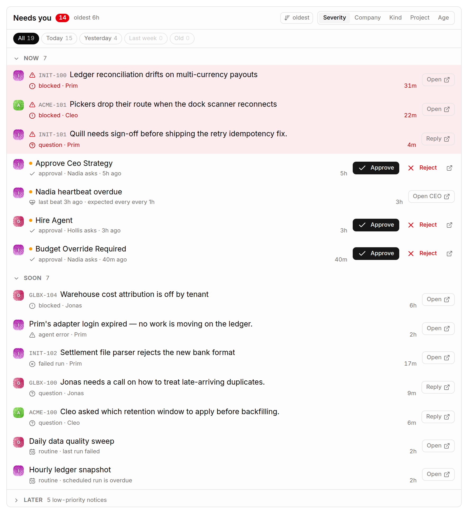
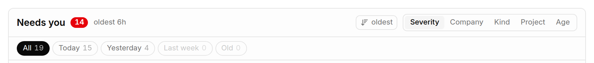
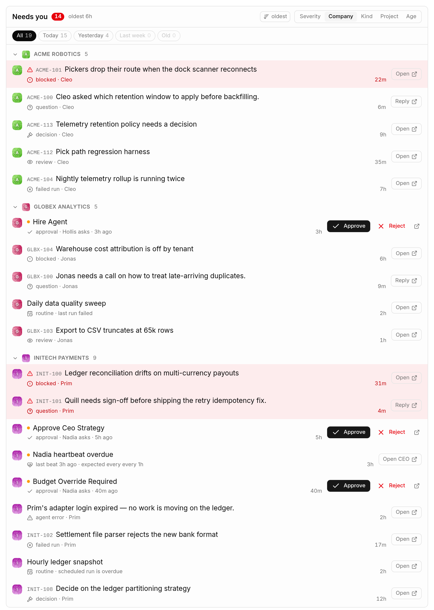
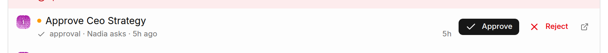

# The Queue

The queue — headed **Needs you** — is every item across every company that is
waiting on a human, in one list, in the order you should work it.

## What lands in it

| Kind | Where it comes from |
| --- | --- |
| **Questions** | `ask_user_questions` interactions on an issue thread. |
| **Confirmations** | Other issue-thread interactions waiting on a response. |
| **Approvals** | Pending approvals. |
| **Heartbeats** | A CEO agent whose heartbeat is overdue. |
| **Failed runs** | Failed runs and agent error alerts. |
| **Routines** | Schedules that stopped firing or whose last run failed. |
| **Blockers** | Blocker attention items. |
| **Other** | Anything else in the attention feed. |

Dismissed attention items are not shown. Approvals appear once, not twice, even
though the attention feed also emits an item for each of them.

## The three buckets

By default the queue groups by severity, which is really "how long can this
wait":

- **Now** — approvals, critical attention, an overdue CEO heartbeat.
- **Soon** — high-severity attention, routines that stopped firing or failed.
- **Later** — medium and low severity.

Within a bucket, items are ordered by an internal rank and then by age.

## Controls

**Grouping** — Severity, Company, Kind, Project, Age. Persisted per browser.

**Sort** — `oldest` or `newest`. This is only the age tiebreaker: severity, then
rank inside the bucket, always wins. It decides which of two equally urgent
items you see first, not whether an urgent thing outranks an old one. Items with
no timestamp sort last either way.

**Age chips** — All / Today / Yesterday / Last week / Old, with a count on each.
This is a *filter*, not a grouping: the point is to make a 137-item list
readable by putting three quarters of it out of sight, which grouping alone
cannot do because every group is still on the page. Persisted, because which
slice of the backlog you work is a habit rather than a glance.

The age buckets are calendar days, measured from local midnight — not rolling
hours. An item raised at 9pm last night is *yesterday's* at 8am today, even
though it is eleven hours old. The same buckets drive the Age grouping and the
chips, so the two can never disagree about which pile something is in. An item
with no timestamp reads as today's rather than being buried under "Old".

**Company focus** — clicking a board row filters the queue to that company; a
"Show all companies" control appears while the filter is on. Not persisted.

## Grouping by company

Reads as a per-company worklist. Useful when you are going to sit down and clear
one company.

## Grouping by project

Cuts the same items the other way, which is how you find the one project quietly
generating half the noise.

## Acting on an item

Actions are inline, so you rarely need to open the company:

- **Approve / Reject** on an approval.
- **Answer** on a question, **Choose** on a confirmation — including structured
  `ask_user_questions` responses, with each question's options in place.
- **Open ↗** on anything, which takes you to the item in its own company.

Clicking the excerpt under a headline expands the full prompt in place. For
thread interactions the feed only carries a server-truncated excerpt, so
expanding fetches the payload and shows every question; for anything else it
just unclamps the text.

A partly-typed answer is kept as a draft, so a poll that arrives mid-sentence
does not lose what you have written.

Cross-company links do a **full page load** rather than an in-app transition.
That is deliberate and is a workaround for a core defect: an in-app hop across
company prefixes leaves the host's sidebar pointing at the previous company for
the rest of the session.

## When it is empty

The empty state says which kind of empty it is — "Nothing needs you right now",
"Nothing from *Acme Robotics* needs you", or "Nothing here from today" — so you
can tell an actually-clear queue from a filter you forgot you set.
